<picture>
  
</picture>

  

<samp>
<a href="https://www.linkedin.com/in/vatsal-tripathi04">linkedin</a> · <a href="mailto:vatsallink04@gmail.com">email</a>
</samp>

  

<blockquote>
CS student, freelance developer. 
Small, sharp tools over big vague ideas.
</blockquote>

I build fast, ship real things, and cut what doesn't get used. Right now 
that's <b>Lume AI</b> — an AI-based deep research assistant that digs 
through sources instead of just summarizing the first page of results.

  

<samp>
html &nbsp;·&nbsp; css &nbsp;·&nbsp; javascript &nbsp;·&nbsp; react &nbsp;·&nbsp; node.js &nbsp;·&nbsp; mongodb &nbsp;·&nbsp; llm &nbsp;·&nbsp; rag
</samp>

  

**Lume AI** &nbsp;·&nbsp; <samp>llm, rag</samp> 
AI-based deep research assistant — goes past the first page of sources 
and synthesizes findings instead of just summarizing search results.

**Productivity Dashboard** &nbsp;·&nbsp; <samp>react, node.js</samp> 
A dashboard for tracking tasks, goals, and daily focus in one place.

**FinTrack Pro** &nbsp;·&nbsp; <samp>react, mongodb</samp> 
Personal finance and money management — track spending, budgets, and goals.

  

 

  

Every graphic above is generated by this repo's own code, not pulled from 
a third-party card service. <samp>portrait.svg</samp> is a photo run through 
a character ramp by <samp>scripts/generate_portrait.py</samp>; the stats 
graphics and these section headings are drawn by <a href="./.github/workflows/refresh-stats.yml">a scheduled GitHub Action</a>, 
once a night, straight from the GitHub GraphQL API — committing only when 
the numbers actually change.

They animate with SMIL inside the SVG, since GitHub strips `<script>` tags 
from READMEs, and since nothing loads from a third party, nothing here can 
rate-limit or go dark. The headings are images for the same reason: GitHub 
also strips `<style>` and `class=`, so an image is the only way to put a 
custom typeface on a heading.

  

freelance developer · portrait + stats regenerated nightly by <a href="./.github/workflows/refresh-stats.yml">refresh-stats.yml</a>
