<picture>
  
</picture>

  

<blockquote>
Self-generating GitHub profile. Every graphic below is drawn by this repo's 
own scheduled workflow — no third-party image services, no rate limits.
</blockquote>

 

  

  

  

  

<samp>python · javascript · sql · linux</samp>

  

portrait + stats regenerated nightly by <a href="./.github/workflows/refresh-stats.yml">refresh-stats.yml</a>
